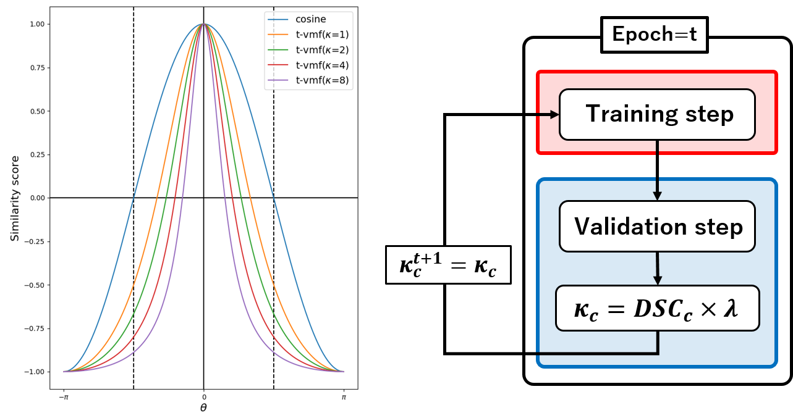
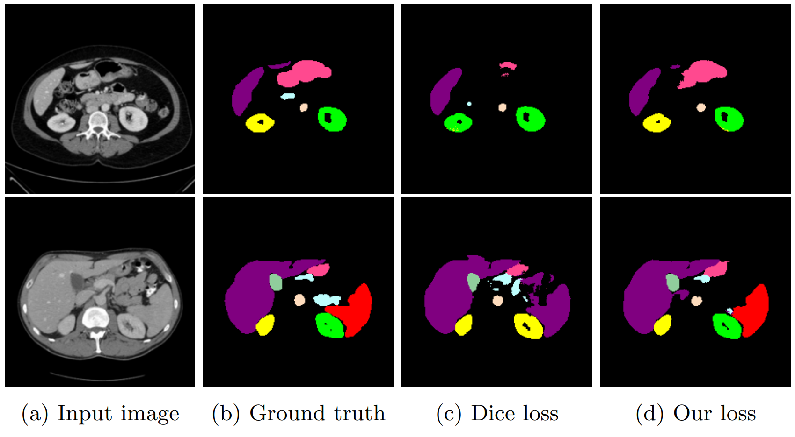

# Adaptive t-vMF Dice Loss
This repository is the official PyTorch implementation ''Adaptive t-vMF Dice Loss for Multi-class Medical Image Segmentation''.

## Introduction
<div align="center">
  
</div>
Dice loss is widely used for medical image segmentation, and many improvement loss functions based on such loss have been proposed. However, further Dice loss improvements are still possible. In this study, we reconsidered the use of Dice loss and discovered that Dice loss can be rewritten in the loss function using the cosine similarity through a simple equation transformation. Using this knowledge, we present a novel t-vMF Dice loss based on the t-vMF similarity instead of the cosine similarity. Based on the t-vMF similarity, our proposed Dice loss is formulated in a more compact similarity loss function than the original Dice loss. Furthermore, we present an effective algorithm that automatically determines the parameter $\kappa$ for the t-vMF similarity using a validation accuracy, called Adaptive t-vMf Dice loss. Using this algorithm, it is possible to apply more compact similarities for easy classes and wider similarities for difficult classes, and we are able to achieve an adaptive training based on the accuracy of the class. Through experiments conducted on four datasets using a five-fold cross validation, we confirmed that the Dice score coefficient (DSC) was further improved in comparison with the original Dice loss and other loss functions.
<br />
<br />
In this repository, we have prepared CVC-ClinicDB dataset and the code of our paper.

## Preparation for CVC-ClinicDB dataset
Please download from [[CVC-ClinicDB]](https://www.kaggle.com/datasets/balraj98/cvcclinicdb) and extract them under $/Dataset, and make them look like this:
```
CVC_ClinicDB
├── train.sh
├── ...
`── Dataset
    ├── archive
        ├── PNG
            ├── Original
            |    ├── 1.png
            |    ├── 2.png
            |    ├── ...
            `── GroundTruth
                 ├── 1.png
                 ├── 2.png
                 ├── ...

```


## Training
If you prepared the dataset, you can directly run the following code to train the model.
```
sh train.sh
```

## Testing
If you generated the pretrain model, you can run the following code to evaluate the model.
```
sh test.sh
```

## Results and Visualization on Synaps multi-organ dataset
<div align="center">
  
</div>

## Citation
```
@misc{kato2022adaptive,
      title={Adaptive t-vMF Dice Loss for Multi-class Medical Image Segmentation}, 
      author={Sota Kato and Kazuhiro Hotta},
      year={2022},
      eprint={2207.07842},
      archivePrefix={arXiv},
      primaryClass={eess.IV}
}
```


